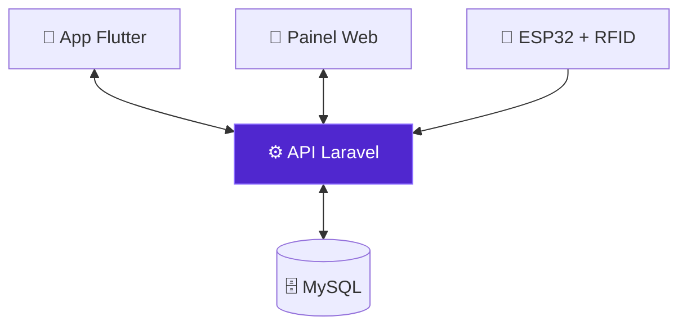

<div align="center">


<br>


<a href="https://linkedin.com/in/SEU-LINKEDIN"></a>
<a href="https://SEU-PORTFOLIO"></a>
<a href="LINK-DO-CURRICULO"></a>

<br><br>


</div>

---

## `00 // RESUMO RÁPIDO`

> **Para recrutadores com 30 segundos:** sou estudante de **Desenvolvimento de Sistemas no SENAI** e desenvolvedor **full stack**. Construí sozinho um sistema completo com **API Laravel, app Flutter e integração IoT com ESP32 + RFID**. Estou procurando **estágio**, remoto ou presencial em **Tambaú-SP**.

<div align="center">

| 🎯 Vaga buscada | 🧠 Stack principal | 📍 Modalidade | 🎓 Formação |
|:--:|:--:|:--:|:--:|
| **Estágio em Desenvolvimento** | Laravel · Flutter · MySQL | Remoto ou Tambaú-SP | ADS · SENAI |

</div>

<div align="center">

```text
┌──────────────────────────────────────────────────────────────┐
│        recruiter@github:~$ ./hire --candidate arthur         │
├──────────────────────────────────────────────────────────────┤
│                                                              │
│  [OK] Full stack: API Laravel + app Flutter + painel web     │
│  [OK] IoT: ESP32 + RFID integrado a uma API REST             │
│  [OK] Projeto real de ponta a ponta (TCC MobiPet)            │
│  [OK] Resolve problemas sozinho e aprende rapido             │
│  [OK] Disponivel: estagio remoto ou presencial (Tambau-SP)   │
│                                                              │
│  > RESULT: MATCH FOUND                                       │
│  > NEXT STEP: entrar em contato  ->  secao 07 // LET'S TALK  │
│                                                              │
└──────────────────────────────────────────────────────────────┘
```

</div>

---

## `01 // POR QUE ME CONTRATAR`

<table>
<tr>
<td width="50%" valign="top">

### 🧱 Entrego o sistema inteiro
Não fico só numa camada. No MobiPet modelei o **banco MySQL**, criei a **API REST em Laravel**, o **painel web** e o **app Flutter** que consome tudo.

</td>
<td width="50%" valign="top">

### 📡 Conecto software ao mundo físico
Integrei um **ESP32 com leitor RFID** à API. O cartão do pet é lido e o status do atendimento muda no app do tutor, sem ninguém clicar em nada.

</td>
</tr>
<tr>
<td width="50%" valign="top">

### 🔧 Resolvo problema de verdade
Meu notebook é um **MacBook Pro 2015**, que não recebe mais atualizações. Atualizei ele sozinho para o **macOS Sequoia com OpenCore Legacy Patcher** para conseguir desenvolver em Flutter. Pesquiso, testo e não desisto.

</td>
<td width="50%" valign="top">

### 🚀 Aprendo rápido e com vontade
Estou estudando **arquitetura de software, APIs RESTful e otimização de banco de dados**, e quero aplicar isso num time real, recebendo feedback e entregando valor desde cedo.

</td>
</tr>
</table>

---

## `02 // PROJETO EM DESTAQUE`

<div align="center">

<a href="https://github.com/ArthurProvidelo/MOBIPET_TCC_2026">

</a>

</div>

**O problema:** em um petshop comum, o tutor deixa o animal e fica sem saber em que etapa o atendimento está.
**A solução:** um ecossistema que conecta **petshop, tutor e hardware**, com acompanhamento em tempo real pelo celular.

<table>
<tr>
<td width="55%" valign="top">

**O que eu construí**

- ⚙️ **API REST em Laravel** com regras de negócio e autenticação
- 🗄️ **Banco MySQL** modelado para tutores, pets, agendamentos e cartões
- 🏪 **Painel web** para o petshop gerenciar atendimentos
- 📱 **App Flutter** para o tutor cadastrar pets e acompanhar o serviço
- 📡 **Firmware ESP32 + RC522**: o cartão RFID identifica o pet e avança o status

`Pendente → Em atendimento → Concluído`

</td>
<td width="45%" valign="top">



</td>
</tr>
</table>

<div align="center">


<br><br>

<a href="https://github.com/ArthurProvidelo/MOBIPET_TCC_2026">

</a>

</div>

---

## `03 // TECH STACK`

<div align="center">

| Área | Tecnologias |
|:--:|:--:|
| **Back-end** |  |
| **Mobile** |  |
| **Front-end** |  |
| **Banco de dados** |  |
| **IoT** |  |
| **Ferramentas** |  |

</div>

---

## `04 // OUTROS PROJETOS`

<div align="center">

<table>
<tr>
<td width="50%" valign="top">

<h3>🌐 Portfólio</h3>

Site pessoal feito do zero em **HTML, CSS e JavaScript puros**, hospedado no **GitHub Pages**.


<br><br>

<a href="https://SEU-PORTFOLIO">

</a>

</td>
<td width="50%" valign="top">

<h3>📱 Projetos Mobile</h3>

Apps em **Flutter e Dart** desenvolvidos nos estudos, explorando interface, estado e consumo de APIs.


<br><br>

<a href="https://github.com/ArthurProvidelo?tab=repositories">

</a>

</td>
</tr>
</table>

</div>

---

## `05 // SOBRE MIM`

<details>
<summary><b><code>$ cat arthur.config.js</code></b> (clique para abrir)</summary>

<br>

```javascript
const arthur = {
    location: "Tambaú-SP, Brasil 🇧🇷",
    education: "Desenvolvimento de Sistemas — SENAI",
    role: "Full Stack Developer",

    stack: {
        backend:  ["PHP", "Laravel", "Python", "MySQL"],
        mobile:   ["Flutter", "Dart"],
        frontend: ["HTML", "CSS", "JavaScript"],
        iot:      ["ESP32", "RFID RC522", "C++"]
    },

    currentlyLearning: ["Software Architecture", "RESTful APIs", "Database Optimization"],
    languages: ["Português", "English"],
    setup: "MacBook Pro 2015 + macOS Sequoia (OCLP)",
    offline: "futevôlei e academia 🏐",

    lookingFor: "Estágio — remoto ou Tambaú-SP",
    available: true
};
```

</details>

---

## `06 // ATIVIDADE NO GITHUB`

<div align="center">


</div>

---

## `07 // LET'S TALK`

<div align="center">

### 💬 Tem uma vaga de estágio? Vamos conversar.

Respondo rápido e estou disponível para **entrevista quando for melhor para você**.

<br>

<a href="mailto:arthur.providelo@aluno.senai.br"></a>
<a href="https://linkedin.com/in/SEU-LINKEDIN"></a>
<a href="https://SEU-PORTFOLIO"></a>
<a href="LINK-DO-CURRICULO"></a>

<br><br>


</div>
